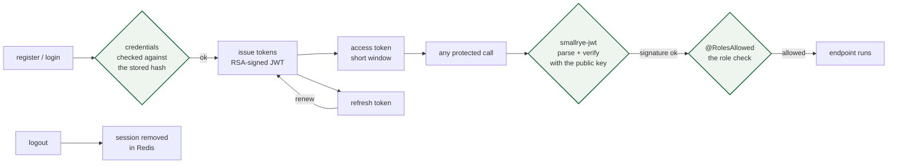

# quarkus-auth-api

**Authentication and account service in Quarkus (Java 17)**: register, login, renew and logout
with RSA-signed JWT, accounts in PostgreSQL, sessions and caches in Redis, OpenAPI/Swagger UI,
and a container image that can be built natively through Jib.

```
POST /auth/register   POST /auth/login   POST /auth/renew   POST /auth/logout   GET /users/me
```

## What this demonstrates

- **JWT that is actually verified**: `smallrye-jwt` does the parsing and signature check with an
  RSA public key, `@RolesAllowed`-style authorization is always enforced
  (`smallrye.jwt.always-check-authorization=true`), and the signing key is a file that never
  enters the repository - `scripts/gen-dev-keys.sh` creates a throwaway pair for development.
- **Cache-aside with Redisson**: Redis is used through Redisson (connection pool, threads and
  Netty threads configured explicitly) rather than a raw client, which is what you want once
  several services share one Redis.
- **Panache repositories as the data layer**: `UserRepository` / `ConfigRepository` over
  Hibernate ORM with an explicit schema policy (`quarkus.hibernate-orm.database.generation`), so
  the schema is a decision, not a side effect.
- **A documented API by default**: SmallRye OpenAPI plus Swagger UI are served from the same
  build, which is how a mobile team can integrate without a spec document.
- **Container-first build**: Jib is wired up (`quarkus.container-image.*`), and it is off by
  default so a plain `mvn package` does not surprise you with a Docker build.

## Endpoints

| Method | Path | Auth | Purpose |
|---|---|---|---|
| POST | `/auth/register` | no | create an account |
| POST | `/auth/login` | no | credentials in, JWT out |
| POST | `/auth/renew` | refresh token | new access token |
| POST | `/auth/logout` | bearer | invalidate the session |
| GET  | `/users/me` | bearer | the caller's profile |
| GET  | `/swagger`, `/swagger-ui.html` | no | the OpenAPI document and UI |

## Quickstart

```bash
git clone https://github.com/lasttoss/quarkus-auth-api.git
cd quarkus-auth-api
make up            # dev keys + postgres + redis + the api
# api      : http://localhost:8081/auth
# swagger  : http://localhost:8081/swagger-ui.html
make down
```

Locally without Docker for the app:

```bash
./scripts/gen-dev-keys.sh certs      # the JWT layer needs a key pair
docker compose up -d postgres redis  # or have both services running
./mvnw quarkus:dev
```

## Configuration

Everything has a development default and is overridable from the environment
(`src/main/resources/application.properties`): `AUTH_PORT`, `DB_URL`, `DB_USERNAME`,
`DB_PASSWORD`, `REDIS_URL`, `REDIS_PASSWORD`, `REDIS_DATABASE`, `JWT_PUBLIC_KEY`,
`JWT_PRIVATE_KEY`. See `.env.example` and `docker-compose.yml`.

The `jdbc` URL defaults to PostgreSQL; a CockroachDB URL works as well since the datasource is
declared as `postgresql`.

Building a container image through Jib is opt-in:
`./mvnw package -Dquarkus.container-image.build=true`.

## Fixed while preparing this repository

1. **The service could not start from a clean clone**: `application.properties` was committed as
   `application.properties.bak`, so Quarkus fell back to defaults with no datasource. There is now
   a real `application.properties` with placeholders for every environment value.
2. **The JWT key pair the build depends on was missing** (and must not be committed), so the app
   died on startup looking for `certs/publickey.pem`. `scripts/gen-dev-keys.sh` generates one for
   development and `certs/` is git-ignored - real keys are mounted.
3. **`application.properties` used to force a container image build on every `mvn package`**
   (`quarkus.container-image.build=true`), which made a normal build slow and fail on machines
   without a Docker daemon. It is now opt-in.
4. **A database password and a Redis password were committed in that `.bak` file.** The file is
   deleted and every credential now comes from the environment.

## Notes / limitations

- `./mvnw test` currently has no tests to run; the CI job builds the jar and generates the
  development keys, which catches the failure modes above.
- `register` / `login` behaviour has not been exercised end to end here - the compose stack is
  the intended way to try it, and the smoke path is: register → login → call `/users/me` with the
  bearer token.

## License

MIT - see [LICENSE](LICENSE). Quarkus is Apache-2.0 and is not redistributed here.

## The token lifecycle as a picture



Four endpoints and one key pair. The half that is easy to get wrong is on the right: a token is only worth
anything once its signature is checked against the RSA public key, and being signed by the server is not the
same as being allowed — the role is checked too. Decoding a payload is not verifying it, and that gap is the
whole difference.

The other half is the two things a stateless token cannot do alone. `/auth/renew` exchanges a refresh token
for a new access token, which is also the one place a renewal can be refused. `/auth/logout` removes the
session in Redis, because a signed token cannot be un-signed — which is why the access token's window is
short: that window is the cost of revocation.

The private key signs and is supplied by the environment, never committed; the public key checks, which is
what lets another service accept these tokens without being able to mint them.

`docs/diagrams/token-lifecycle.mmd` is the Mermaid source; `make diagram` exports a PNG if a browser is
present.

## The chart

`charts/auth-api/` deploys the service with the two things an auth service needs from a deploy: a rolling update
that never takes a replica out of the Service before its successor can answer (`maxUnavailable: 0`), so a login
arriving mid-roll is still answered, and a PodDisruptionBudget that keeps one serving through a disruption. It
also carries an HPA, no service-account token, a read-only root filesystem with an `emptyDir` for the `/tmp` a
JVM writes to, and a NetworkPolicy allowing the one port in and only DNS plus PostgreSQL and Redis out.

The signing key pair is not a value. The chart takes `secret.existingSecret`, the name of a Secret that already
holds the credentials and `JWT_PRIVATE_KEY` / `JWT_PUBLIC_KEY` - a chart that accepts a private key as a value is
a chart that gets one committed.

```bash
make chart     # helm lint --strict + helm template
```

## Coverage

Measured with `./mvnw -B test` plus the JaCoCo plugin (line and branch):

| | covered / total | |
|---|---|---|
| lines | 44 / 243 | **18.1%** |
| branches | 3 / 26 | **11.5%** |

By package, the number says where the suite looks:

| package | lines |
|---|---|
| `models` | 100.0% |
| `mappers` | 93.3% |
| `constants` | 35.7% |
| `services` | 0.0% (118 lines) |
| `repositories` | 0.0% (14 lines) |

Models and mappers are fully or nearly covered; the service layer and the storage access are not, and for the same
reason as in the other service: the tests that need PostgreSQL and Redis are the ones tagged `integration`, and CI
runs only the unit suite. The jacoco plugin is committed so the number can be reproduced rather than taken on
trust.
